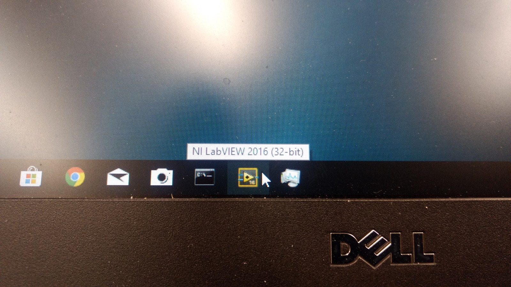
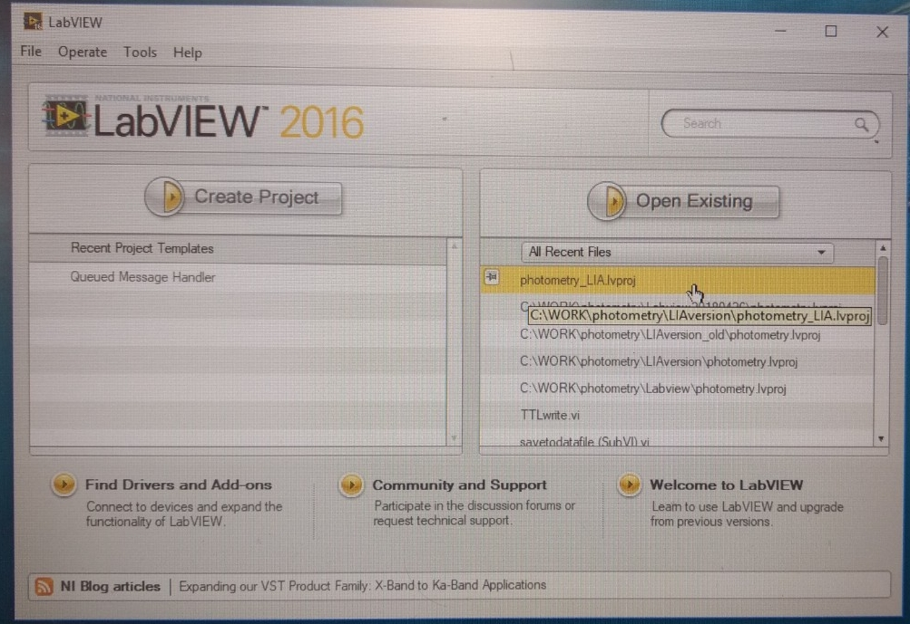
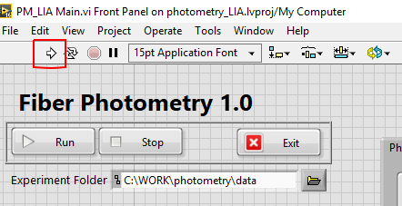
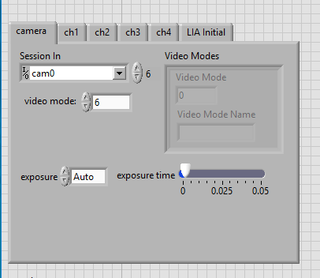
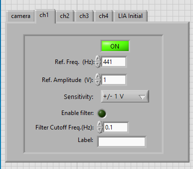
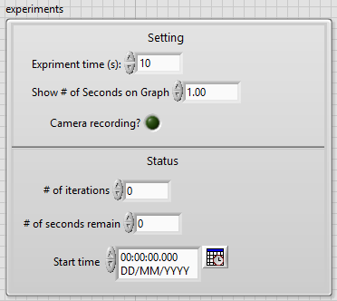
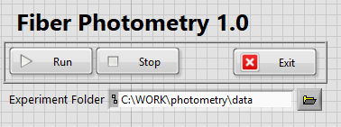

# Running the acquisition software:

Once the system is properly wired, connected and turned on, we need to start the Labview application
wrote by Chen.

- Click on the labview2016 icon at the taskbar.

- Open the existing project "Photometry_LIA.lvproj"

- Double click the "PM_LIA Main.vi" file on the project explorer

- this will open the main window, to start the software, click on the arrow on the top:

 - Now the software is ready for settings changes (camera mode/led properties).

  - users can set Camera and LEDs profiles using the tabs on top left.

main window with camera tab selected:

main window with one of the LEDs tabs selected

 - Experiment time, camera recording, graph display options can be changed in the experiments tab, below the led/camera tabs

 

 Once all options have been set, users can start the recording of fluorescence traces and camera feed by clicking the "Run" button on the top:

 
